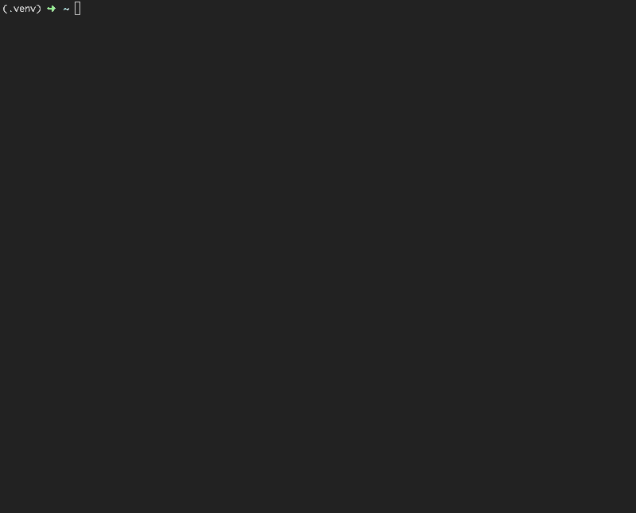

# SkyWatch Data Sources

[](https://travis-ci.org/bruno-source/skywatch-data-sources)
[](https://coveralls.io/github/bruno-source/skywatch-data-sources?branch=update-docs)

Command-line interface to list SkyWatch's data sources



## Instalation

Download and install the latest version from GitHub:
```
$ python -m venv .venv
$ source .venv/bin/activate
$ pip install git+https://github.com/bruno-source/skywatch-data-sources.git@v0.1#egg=skywatch_data_sources
```

## Usage
From the command-line:
```
$ skywatch-data-sources
╒═════════════════════════╤════════════╤══════════════╕
│ Source                  │ Provider   │ Resolution   │
╞═════════════════════════╪════════════╪══════════════╡
│ TripleSat Constellation │ 21AT       │ 80cm         │
├─────────────────────────┼────────────┼──────────────┤
...

$ skywatch-data-sources --help
Usage: skywatch-data-sources [OPTIONS]

  Parses www.skywatch.com and returns a list of its available data sources
  in a pretty-printed tabular data.

Options:
  --help  Show this message and exit.
```


Python console:
```
>>> from skywatch_data_sources.cli import list_data_sources
>>> list_data_sources()
╒═════════════════════════╤════════════╤══════════════╕
│ Source                  │ Provider   │ Resolution   │
╞═════════════════════════╪════════════╪══════════════╡
│ TripleSat Constellation │ 21AT       │ 80cm         │
├─────────────────────────┼────────────┼──────────────┤
```

## Testing
- With Pipenv:

    ```console
    $ git clone https://github.com/bruno-source/skywatch-data-sources
    $ cd skywatch-data-sources
    $ pipenv install --dev
    $ pipenv run pytest
    ```

- With Virtualenv:

    ```console
    $ git clone https://github.com/bruno-source/skywatch-data-sources
    $ cd skywatch-data-sources
    $ python -m venv .venv
    $ source .venv/bin/activate
    $ pip install -r requirements.txt
    $ pytest
    ```
